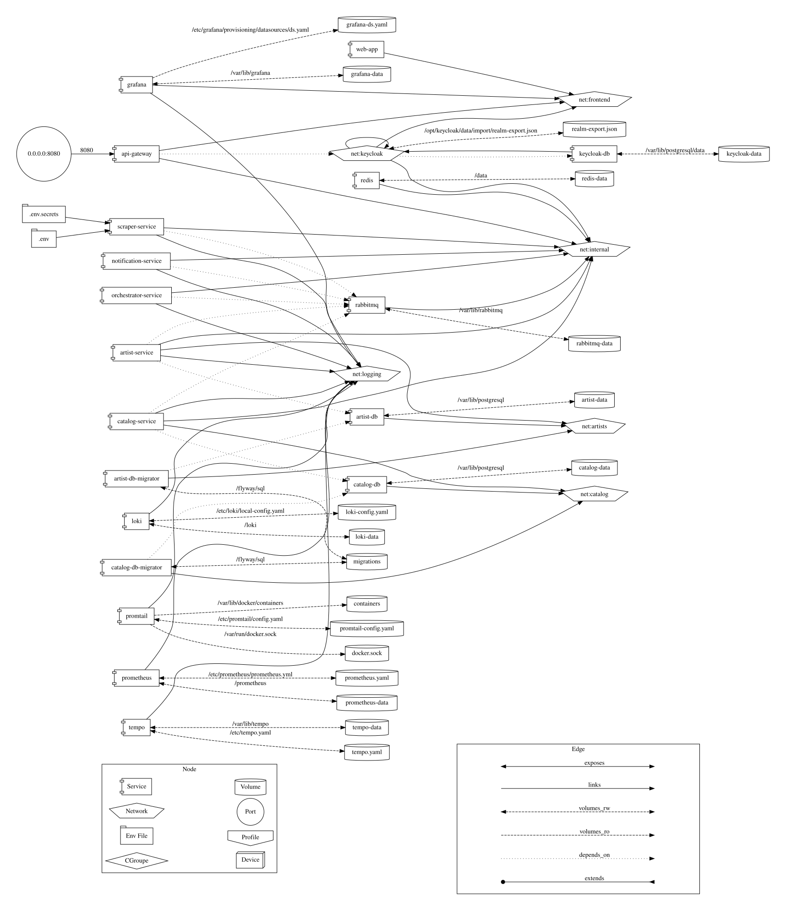

# music-catalog

Zbudowane obrazy na Docker Hub: https://hub.docker.com/repositories/wisnieibiszkopty

Uzasadnienie użycia obrazów z wysokimi lub krytycznymi podatnościami znajduje się w pliku docker/reports/reports.md

## Uruchomienie projektu

Aby zbudować obrazy kontenerów lokalnie i uruchomić aplikacje należy użyć polecenia: `docker compose up --build`

Aby uruchomić aplikacje wykorzystując obrazy znajdujące się nad Docker Hub należy uzyć polecenia: `docker compose -f docker-compose.yml up`

Aplikacja automatycznie zapełnia baze danymi testowymi, jednak w celu
użycia wszystkich funkcjonalności należy utworzyć plik `.env.secrets` na podstawie
pliku `.env.secrets.example` i umieszcić tam klucze pozwalające na dostęp do 
Spotify Web API: https://developer.spotify.com/documentation/web-api, a następnie 
zbudować jeszcze raz usługę scraper-service.

## Struktura katalogów

Położenie wszystkich użytych w projekcie plików Dockerfile zostało 
przedstawione w poniższej strukturze katalogów. 

```
music-catalog/
├── docker/
│   └── docker-compose.yaml
│   └── docker-compose.override.yaml
│   └── reports
│       └── reports.md
├── docs/
├── frontend/
│   └── Dockerfile
├── infra/
├── services/
│   ├── ApiGateway/
│   │   └── Dockerfile
│   │   └── Dockerfile_arm
│   ├── Artists.Service/
│   │   └── Dockerfile
│   ├── Catalog.Service/
│   │   └── Dockerfile
│   ├── Notification.Service/
│   │   └── Dockerfile
│   ├── Orchestrator.Service/
│   │   └── Dockerfile
│   └── Scraper.Service/
│       └── Dockerfile
├── shared/
├── .dockerignore
├── .gitignore
├── MusicCatalog.slnx
└── README.md
```

## Architektura systemu


## Przepływ zdarzeń dla scrapera artystów


## Przepływ zdarzeń dla scrapera albumów


## Graficzna reprezentacja pliku docker-compose


